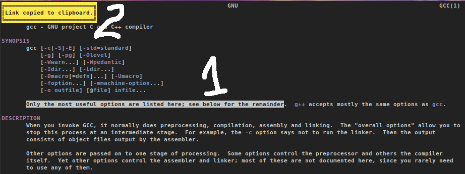

Encrypt selected text within urxvt with **gpg** for the hidden recipient with given **$pubKey** (this is variable inside the script which have to be edited by hand) and upload the encrypted content to http://sprunge.us . Since the recipient is hidden, anyone willing to extract metadata about the recipient will be out of luck. Only the recipient with the correct **$pubKey** can decrypt and read the content.

# Installation

Simply place the script in **/usr/lib/urxvt/perl/** for
system-wide availability or in **~/.urxvt/ext/** for user-only availability.
You can also put it in a folder of your choice, but then you have to add this
line to your **.Xdefaults/.Xresources**:

```bash
URxvt.perl-lib: /home/user/your/folder/
# extension to activate
URxvt.perl-ext-common           : encrypt

# keyboard shortcut to trigger the extension
URxvt.keysym.Control-Shift-G    : perl:encrypt:encrypt
```

# Requirements

* urxvt (rxvt-unicode) compiled with support for perl
